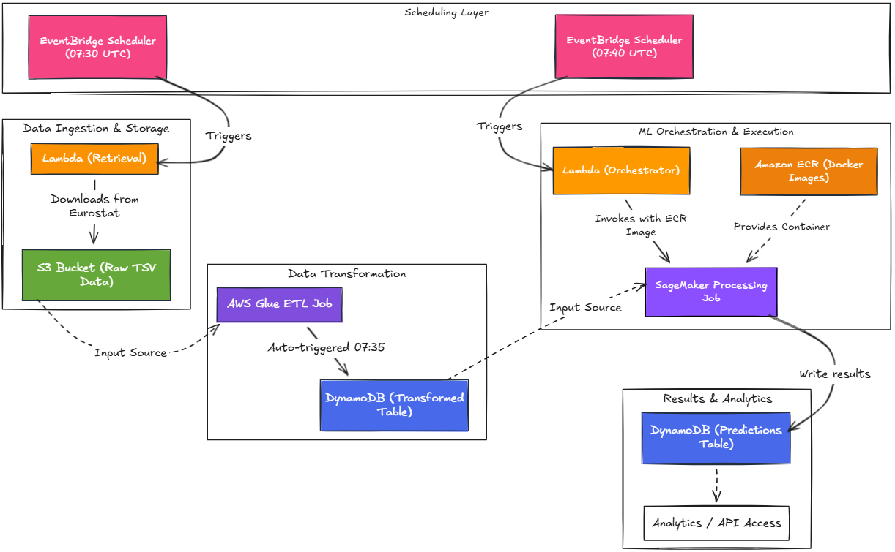
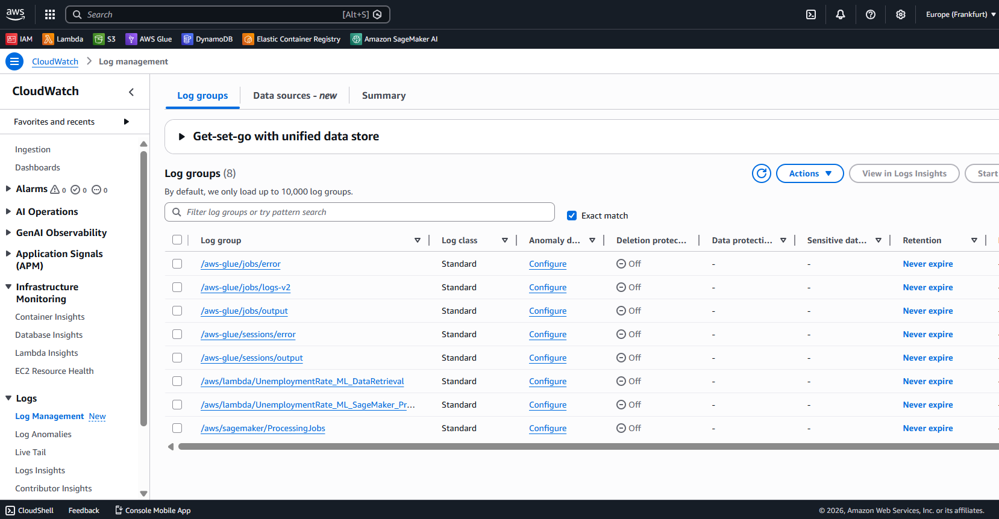
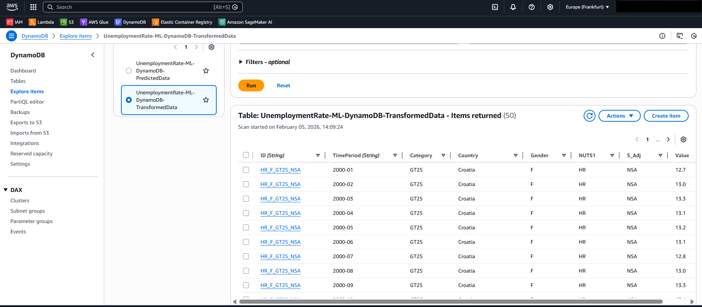
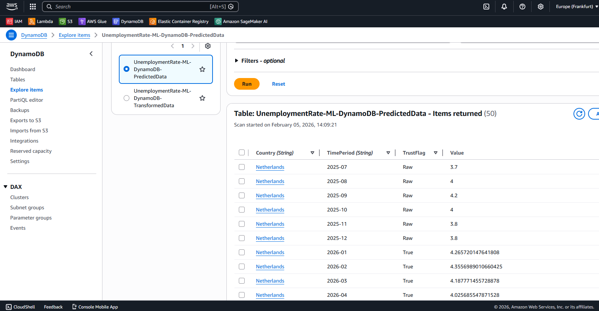
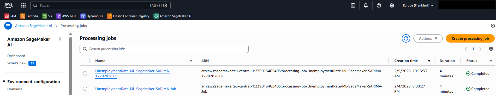
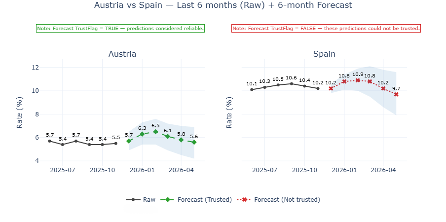

# 📊 Unemployment Forecasting Platform

### End-to-End MLOps & Data Engineering System on AWS

> Production-style ETL + ML platform for automated unemployment forecasting using AWS, SARIMA, and containerized processing.

This project demonstrates my ability to **design, build, deploy, and operate** a complete machine learning system in the cloud — covering data ingestion, transformation, modeling, automation, security, and cost-aware infrastructure.

It reflects how I approach real-world ML systems: **reliable, reproducible, observable, and scalable**.

---

## 🔍 Project Overview

This repository implements a fully automated monthly pipeline that:

* Collects official unemployment data from Eurostat
* Cleans and normalizes time series data
* Trains and evaluates forecasting models per country
* Generates short-term forecasts with confidence intervals
* Stores results for downstream analytics
* Operates on a scheduled, serverless-first architecture

The system is designed following modern **MLOps and Data Engineering best practices** using AWS managed services.

---

## 🧠 Key Engineering Competencies Demonstrated

✔ End-to-end ML system design
✔ Production-grade ETL pipelines
✔ Containerized ML workloads
✔ Infrastructure security (IAM least privilege)
✔ Cost-efficient cloud architecture
✔ Automated retraining workflows
✔ Model evaluation and validation
✔ Cloud-native observability
✔ Reproducible deployments

This project reflects how I work in professional environments: owning the full lifecycle from raw data to production output.

---

## 🏗️ System Architecture (Simplified)

```
Eurostat API
     │
     ▼
AWS Lambda (Ingestion)
     │
     ▼
Amazon S3 (Raw Zone)
     │
     ▼
AWS Glue (ETL)
     │
     ▼
DynamoDB (Clean Data Store)
     │
     ▼
AWS Lambda (Orchestration)
     │
     ▼
SageMaker Processing (Docker/ECR)
     │
     ▼
DynamoDB (Predictions)
```

You can see the AWS Architecture Diagram in the **Images & Screenshots** section

### Architecture Principles

* Serverless-first where possible
* Stateless compute
* Separation of raw / processed / predicted layers
* Minimal operational overhead
* Pay-per-use cost model

---

## 🔄 Data & ML Workflow

### 1️⃣ Data Ingestion

* Scheduled Lambda downloads compressed Eurostat datasets
* Validates schema and stores raw data in S3
* Handles failures and retries

### 2️⃣ Data Transformation

* AWS Glue normalizes wide-format TSV to time series
* Applies filtering and enrichment
* Writes structured records to DynamoDB

### 3️⃣ ML Orchestration

* Dedicated Lambda triggers SageMaker jobs
* Manages container execution and resource allocation

### 4️⃣ Model Training & Forecasting

* Runs inside a custom Docker image
* Loads time series per country
* Trains SARIMAX models
* Evaluates performance
* Generates forecasts + confidence intervals

### 5️⃣ Persistence & Serving

* Results stored in DynamoDB
* Ready for BI dashboards or APIs

---

## 📁 Repository Structure

```
.
├── ECR/                # Docker image for ML workloads
├── Glue/               # ETL transformation job
├── Images/             # Images and screenshots
├── Lambdas/            # Ingestion and orchestration
├── SageMaker/          # Training & inference logic
└── README.md
```

Each component is isolated and deployable independently.

---

## 🤖 Modeling Strategy

* Problem type: Multivariate seasonal time series forecasting
* Frequency: Monthly
* Granularity: Per country

### Model

```
SARIMAX (2,1,1) × (1,1,1,12)
```

* Seasonal modeling
* Differencing for stationarity
* Retrained per country

### Training & Evaluation

* Rolling split (last 12 months as test)
* Metrics: MAE, RMSE
* Automatic reliability flag
* Retraining on full dataset before forecasting

### Output

* 6-month forecast
* 95% confidence intervals
* Performance metadata

---

## 🔐 Security & IAM Design

The platform follows **least-privilege principles**:

* Separate IAM roles per service
* Scoped S3 access
* Fine-grained DynamoDB permissions
* ECR read-only roles
* CloudWatch logging policies

No service has global access.

This mirrors production security standards.

---

## 💰 Cost-Aware Infrastructure

Designed to minimize idle resources:

* Serverless ingestion
* On-demand Glue
* Ephemeral SageMaker jobs
* No persistent compute
* Automatic job shutdown

---

## ⚙️ Deployment Components

### Required AWS Resources

* S3 (raw storage)
* DynamoDB (clean + predictions)
* Glue Job
* ECR Repository
* Lambda Functions
* SageMaker Processing Role
* CloudWatch Logs
* EventBridge Schedules

---

## 📈 Observability & Monitoring

* Centralized CloudWatch logs
* Per-job execution tracking
* Metric reporting
* Training diagnostics

This enables root-cause analysis and operational stability.

---

## 📸 Images & Screenshots

* AWS Architecture Diagram


* CloudWatch Logs


* DynamoDB Tables



* SageMaker Job Runs


* Forecast Example Plot


---

## 👨‍💻 About the Author

**Alberto Alcántara Solís**
Data Engineer / MLOps / AI Engineer

* 4+ years in production data systems
* AWS-certified
* Specialized in ML pipelines and cloud-native deployments
* Focused on reliability, automation, and scalability

📍 Spain
🔗 [LinkedIn](https://www.linkedin.com/in/alberto-alcantara-solis/)

---

## 📜 License

MIT License

---

## ⭐ Why This Project Matters

This repository is not a toy example.

It demonstrates:

* How I design ML systems
* How I manage cloud infrastructure
* How I think about reliability and cost
* How I bring models into production
* How I own systems end-to-end

It reflects how I work in real teams and environments.

---
